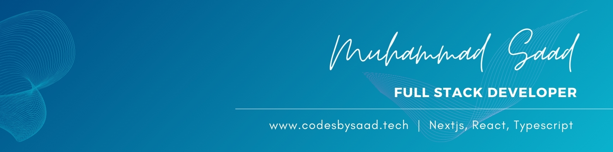

Hi 👋 My name is Muhammad Saad
===============================

Aspiring Full-Stack Engineer
----------------------------

⤷ I am a  passionate and dedicated Computer Science student at the University of the Punjab - Gujranwala Campus, currently in my 3rd year (Batch of 2025). My journey in tech has been a blend of self-learning, practical experience, and leadership. With a strong focus on Full-Stack Web Development, I specialize in using the MERN stack and JavaScript technologies. My expertise extends to both frontend and backend development, ensuring a seamless and robust web experience.

- 🔭 I’m currently working on [(OptaHire FYP - App MERN)](https://github.com/itxSaaad/opta-hire-ai-recruitment-fyp-app-mern) [(Live Link)](https://opta-hire-ai-recruitment-fyp-app-mern.vercel.app/)
- 🌱 I’m currently learning **WebRTC, Socket.io**
- 💬 Ask me about **React, Redux/Toolkit, Node, Express and Mongo**
- 📫 How to reach me **saadstudent.cs@gmail.com**
- 📄 Know about my experiences [LinkedIn/itxsaaad/](https://www.linkedin.com/in/itxsaaad/)
- 👨‍💻 All of my projects are available at [Portfolio/itxSaaad](https://www.codesbysaad.tech/)

### Skills

### Socials

 
   
   
   
   
   
  
   
  

### Badges

<b> HacktoberFest 2022 Badges</b>

<b>My GitHub Stats</b>

### Support Me

